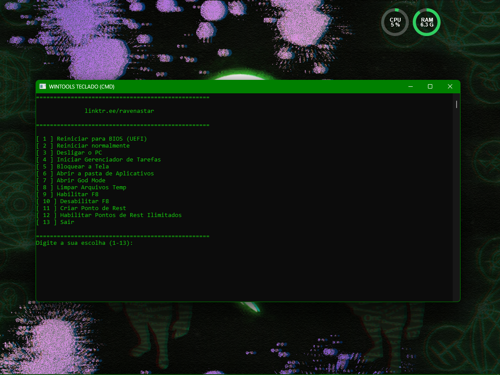
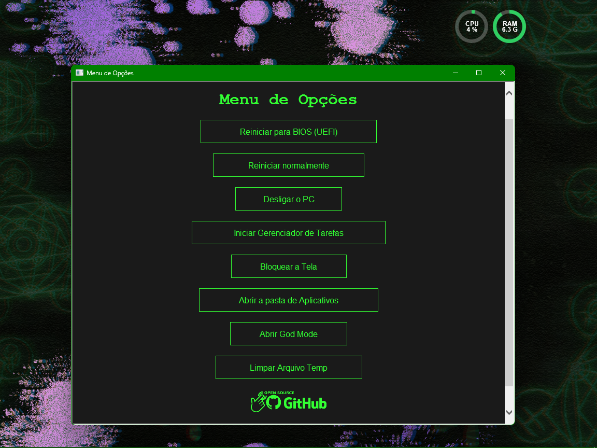

> [!IMPORTANT]    
> ⚠️  Para evitar problemas, execute os scripts como administrador.

### 🚀 **WinTools: Um Simples e Útil Kit de Ferramentas para Windows!**

Este projeto oferece uma coleção de scripts que facilitam suas tarefas diárias no Windows, permitindo que você:

- Reinicie diretamente para a BIOS (UEFI) com apenas alguns cliques.
- Reiniciar o seu dispositivo normalmente.
- Desligar seu dispositivo.
- Inicie o Gerenciador de Tarefas num piscar de olhos.
- Bloqueie a tela de seu dispositivo.
- Acesse facilmente a pasta de aplicativos do Explorer.
- Desvende o God Mode do Windows para um controle total do sistema.
- Limpe arquivos temporários para liberar espaço e melhorar o desempenho.
- E muito mais...

Ideal para administradores de sistemas, desenvolvedores, e todos que desejam otimizar seu fluxo de trabalho no Windows. 💻✨

### ✨ Observações
- O arquivo `WINTOOLS TECLADO (CMD)` é o [TOOLS/menu.cmd](TOOLS/menu.cmd), um atalho para facilitar e executar o script como administrador.
- O arquivo `WINTOOLS MOUSE (HTA)` é o [TOOLS/mouse/menu.hta](TOOLS/mouse/menu.hta), um atalho para facilitar e executar o script como administrador.
> `WINTOOLS MOUSE (HTA)` Foi criado para, caso o dispositivo não tenha um teclado funcionando, seja possível executar os scripts via mouse.
- Se os atalhos `WINTOOLS TECLADO (CMD)` e `WINTOOLS MOUSE (HTA)` não estiverem funcionando, basta editar o atalho e mudar o caminho deles apontando para os arquivos respectivos:
  - `WINTOOLS TECLADO (CMD)` => [TOOLS/menu.cmd](TOOLS/menu.cmd)
  - `WINTOOLS MOUSE (HTA)` => [TOOLS/mouse/menu.hta](TOOLS/mouse/menu.hta)

### 📷 Prévias

⌨ WINTOOLS TECLADO (CMD)

🖱️ WINTOOLS MOUSE (HTA)

