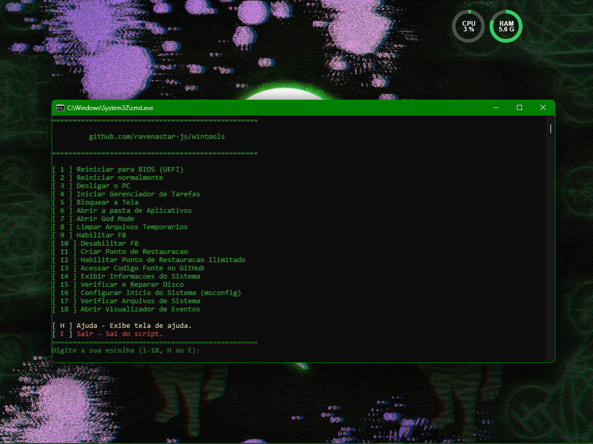

> [!IMPORTANT]
> ⚠️ Para evitar problemas, os scripts são executados automaticamente como administrador.
> 
> Execute o arquivo `GerarArquivos.bat` para criar os arquivos necessários para o funcionamento do script.
> 
> O arquivo `GerarArquivos.bat` cria o atalho `WINTOOLS (CMD)` que fica na raiz do projeto e o arquivo `menu.cmd` que fica na pasta `TOOLS`. Caso o `menu.cmd` já exista, o conteúdo de `menu.cmd` será atualizado automaticamente. O arquivo `menu.js`, localizado na pasta `js` que fica dentro da pasta `TOOLS`, é o responsável por criar ou atualizar o conteúdo de `menu.cmd`.

### 🚀 **WinTools: Um Simples e Útil Kit de Ferramentas para Windows!**

Este projeto oferece uma coleção de scripts que facilitam suas tarefas diárias no Windows, permitindo que você:

- Reinicie diretamente para a BIOS (UEFI).
- Reiniciar o seu dispositivo normalmente.
- Desligar seu dispositivo.
- Inicie o Gerenciador de Tarefas.
- Bloqueie a tela de seu dispositivo.
- Acesse facilmente a pasta de aplicativos do Explorer.
- Desvende o God Mode do Windows para um controle total do sistema.
- Limpe arquivos temporários para liberar espaço e melhorar o desempenho.
- E muito mais...

Ideal para administradores de sistemas, desenvolvedores, e todos que desejam otimizar seu fluxo de trabalho no Windows. 💻✨

### ✨ Observações
- O arquivo `WINTOOLS (CMD)` é o [TOOLS/menu.cmd](TOOLS/menu.cmd), um atalho para facilitar a execução do script.
- Se o atalho `WINTOOLS (CMD)` não funcionar, basta editar e mudar o caminho e apontar para o arquivo respectivo:
  - `WINTOOLS (CMD)` => [TOOLS/menu.cmd](TOOLS/menu.cmd)

### 📷 Prévias

WINTOOLS (CMD)

Criando a Quick Launch

Teclas de Atalho do Windows

#### Atalhos com Tecla Win

| **Função**                                        | **Tecla de Atalho**      |
| ------------------------------------------------- | ------------------------ |
| **Mostrar área de trabalho**                      | Win + D                  |
| **Minimizar todas as janelas**                    | Win + M                  |
| **Restaurar janelas minimizadas**                 | Win + Shift + M          |
| **Redimensionar e mover janelas**                 | Win + Setas (↑ ↓ ← →)    |
| **Bloquear o computador**                         | Win + L                  |
| **Abrir o Explorador de Arquivos**                | Win + E                  |
| **Abrir Configurações**                           | Win + I                  |
| **Abrir a busca**                                 | Win + S                  |
| **Capturar a tela inteira e salvar como arquivo** | Win + PrtScn             |
| **Capturar uma parte da tela**                    | Win + Shift + S          |
| **Reiniciar a placa gráfica**                     | Win + Ctrl + Shift + B   |
| **Abrir a Central de Ações**                      | Win + A                  |
| **Abrir a Barra de Notificações**                 | Win + N                  |
| **Abrir a Visão de Tarefas**                      | Win + Tab                |
| **Mostrar ou esconder a Barra de Tarefas**        | Win + T                  |
| **Maximizar a janela**                            | Win + Setas (↑)          |
| **Minimizar a janela**                            | Win + Setas (↓)          |
| **Restaurar janela maximizada**                   | Win + Setas (↓)          |
| **Mover janela para a metade esquerda**           | Win + Setas (←)          |
| **Mover janela para a metade direita**            | Win + Setas (→)          |
| **Criar uma nova Área de Trabalho**               | Win + Ctrl + D           |
| **Fechar a Área de Trabalho atual**               | Win + Ctrl + F4          |
| **Alternar entre Áreas de Trabalho**              | Win + Ctrl + Setas (← →) |
| **Abrir Cortana (por voz)**                       | Win + C                  |
| **Abrir o Hub de Feedback**                       | Win + F                  |
| **Abrir a Conexão de Projeção**                   | Win + K                  |
| **Acessar a área de transferência**               | Win + V                  |
| **Desbloquear o narrador**                        | Win + Ctrl + Enter       |

#### Outros Atalhos

| **Função**                          | **Tecla de Atalho** |
| ----------------------------------- | ------------------- |
| **Copiar**                          | Ctrl + C            |
| **Colar**                           | Ctrl + V            |
| **Recortar**                        | Ctrl + X            |
| **Desfazer**                        | Ctrl + Z            |
| **Selecionar tudo**                 | Ctrl + A            |
| **Alternar entre janelas abertas**  | Alt + Tab           |
| **Fechar a janela ativa**           | Alt + F4            |
| **Abrir o Gerenciador de Tarefas**  | Ctrl + Shift + Esc  |
| **Abrir o Menu Iniciar**            | Ctrl + Esc ou Win   |
| **Selecionar a barra de endereços** | Ctrl + L            |
| **Exibir histórico de comandos**    | F7                  |
| **Abrir Busca de arquivo ou pasta** | F3                  |

### 💡 EXTRAS 

  Windows Rápido e Seguro 2.0

 
  
`Aula 1:` <a href="https://www.baboo.com.br/cursos/aula-01">Introdução e erros a evitar</a> 
`Aula 2:` <a href="https://www.baboo.com.br/cursos/aula-02">Análise do disco rígido e SSD</a> 
`Aula 3:` <a href="https://www.baboo.com.br/cursos/aula-03">CHKDSK SFC DISM</a> 
`Aula 4:` <a href="https://www.baboo.com.br/cursos/aula-04">Windows Update</a> 
`Aula 5:` <a href="https://www.baboo.com.br/cursos/aula-05">Desinstalação de programas dispensáveis</a> 
`Aula 6:` <a href="https://www.baboo.com.br/cursos/aula-06">Remoção de arquivos temporários</a> 
`Aula 7:` <a href="https://www.baboo.com.br/cursos/aula-07">AdwCleaner + uBlock Origin + TrafficLight</a> 
`Aula 8:` <a href="https://www.baboo.com.br/cursos/aula-08">KVRT e HouseCall</a> 
`Aula 9:` <a href="https://www.baboo.com.br/cursos/aula-09">ESET Online Scanner, Emsisoft Emergency Kit e Malwarebytes Premium</a> 
`Aula 10:` <a href="https://www.baboo.com.br/cursos/aula-010">Desfragmentação e dicas finais</a> 

BANNER INSPIRADO EM
 

